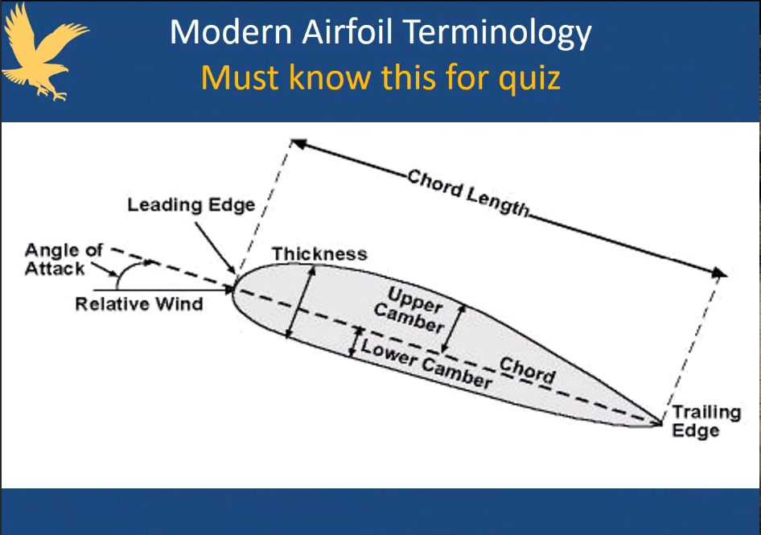
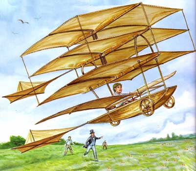
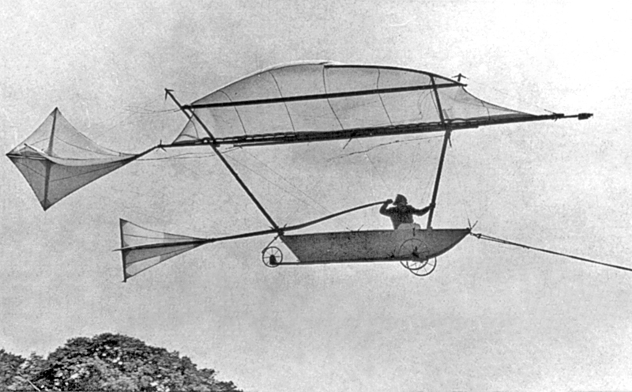

# Airfoil
Structure designed to obtain a reaction upon its surface from the air through which it moves

#### Must know

### 4 Forces Acting on an Airplane
1. Thrust
	- Forward force produced by the propeller
2. Drag
	- Rearward force created by distribution of airflow by wing, fuselage and other protruding objects
3. Weight
	- Downward force poduced by combined load of the airplane, crew, fuel, and baggage
			\>> Center of Gravity
4. Lift
	- Upward force produced by dynamic effect of air acting on the wing 
			\>> Center of lift
			
---

# Control Surfaces

#### 1. Pitch: Elevator
#### 2. Roll: Ailerons
#### 3. Rudder

---

# Great Glider Pilots

## Sir Cayley
- Often referred too as **the father of aviation**
- Used a **barn door** as his **control surface**
- Not yet dicovered **camber**

### Cayley's Inspired Discovery
Lift,  which makes wing borne flight possible, results from driving an inclined plane against the wind

- First test his ideas with small models and then gradually progress to full-scale demonstraions

### Camber
- Cayley discovered that a curved shape generates lift
- A flat wing doesn't generate lift

1. Lift generated by region of low pressure on upper surface of the wing and high pressure on the bottom surface

Published his 15 years of work, but why?
**Most important papers in aviation**

#### 1849 Glider
- Cayley's first full-size glider in 1849
- In 1849, ten-year-old son of one his servants became the first person in history to fly a heavier-than-air airplane

#### 1853 Glider - 80 years old
- In 1853, a single-wing glider
- First recorded flight by an adult in a heavier-than-air aircraft

---

## Alphonse Penaud
- First person to fly heavier than air rubber band powered model flying machines
- "The Father of Flying Models"

#### Wright Brothers
- Penaud's toys made Wright brothers interested in aviation

---

## Otto Lilienthal
- First successful aviatior with over 2,000 glider flights
- Built his first glider in 1891

#### Lilienthal's 1891 Glider
- Could glide almost 80 feet
- First successful manned, heavier-than-air flying machine

#### Lilienthal's Hill
- In 1894, he built an artificcial hill to store and test his aircraft

---

## Octave Chanute
- Publishes aeronautical history

 #### 1894 "_Progress in Flying Machines_"
- First history of aviation
- No single book contributed more to the development of aviation
- Free exchange of ideas
- Solid survey of almost every important experiment and invention relating to aviation
- Careful study of past failures

- Frist glider tested was a Lilienthal glinder that Herring built from plans

#### Critical items missing for the truly successful flight:
1. Engine
2. Control

